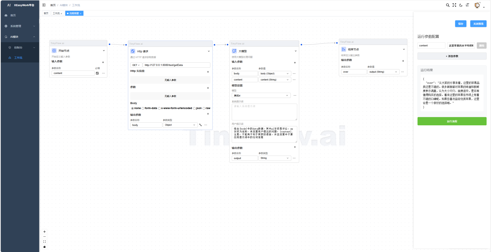
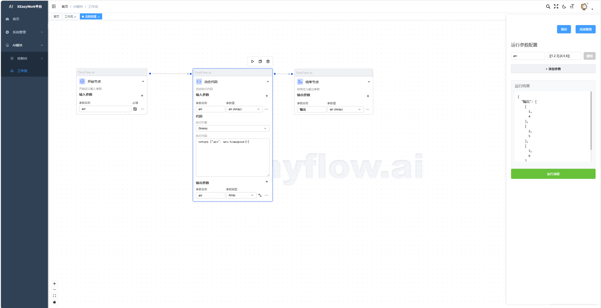
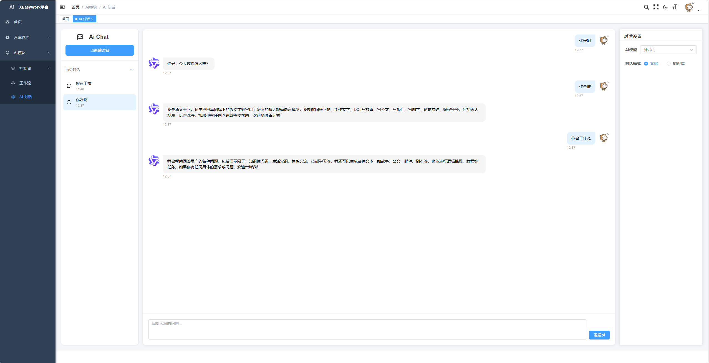

# XEasyWork

#### 介绍
一款面向AI应用开发的可视化工作流平台，核心定位是降低AI技术落地门槛。
通过拖拽式界面支持快速构建AI对话系统（如智能客服、虚拟助手），并提供可扩展架构为后续接入多模态、智能体(AI Agent)等前沿能力预留空间。

#### 战略级整合
整合了若依、tinyflow、Agents-Flex、EasyAi等目前比较优秀的ai开源项目，目的就是为了开发一款可供JDK8的AI应用

✅ 自主开发模块：工作流引擎、动态编排器、混合知识检索系统  

⚙️ 集成开源项目：  
- [tinyflow](https://gitee.com/tinyflow-ai/tinyflow)（AI 智能体）  
- [tinyflow-java](https://gitee.com/tinyflow-ai/tinyflow-java)（AI 智能体）  
- [Agents-Flex](https://gitee.com/agents-flex/agents-flex)（ 一个基于 Java 的 LLM（大语言模型）应用开发框架。）  
- [EasyAi](https://gitee.com/dromara/easyAi)（国内TOP1开源原生Java人工智能算法框架）

#### 安装教程

1. 导入sql
2. 修改后端yml配置
3. cd xeasywork-vue
4. npm i
5. npm run dev

#### 更新教程
1.  新建数据库导入sql文件
2.  使用navicat数据库工具进行表结构同步
3.  进行数据同步-菜单表（sys_menu）、字典表数据（sys_dict_data、sys_dict_type）（其他表可选）

#### 未来规划
1.  调研市场需求
2.  更新更多ai应用，如：智能客服，数字人、图像理解等实用性功能

#### 使用说明

